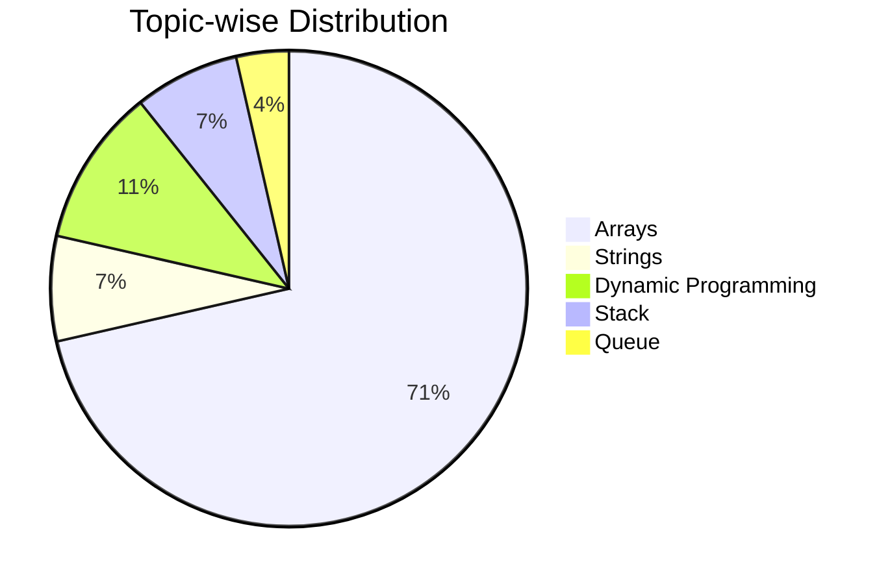

<!--Night Owl image-->

  

#  ɪ'ᴍ SANTOSH! 
*Gssoc'26 Contributer (Developer / Programmer)*
  

 Software Developer |Open Source Contributor (GSSoC '26) | Cybersecurity Enthusiast | currently pursuing Bachelor of Engineering Computer Science. 

<!--End Intro-->

---

<!--About Section-->
<h3 align="left">ABOUT</h3>
<ul align="left">
  <li>My name is Santosh Kumar Mahato, and I am currently pursuing a Bachelor of Engineering in Computer Science (2nd Year). I am passionate about software development and cybersecurity, with a strong interest in building practical solutions and continuously expanding my technical knowledge.
    
I have experience with programming(like:- Python, Java, C/C++), version control using Git and GitHub, and effective communication. I am also multilingual, speaking languages(like:- English, Nepali, Hindi, Maithili, Bhajpuri, which helps me connect with people from diverse cultural backgrounds and collaborate effectively in teams.

As a multicultural student, I enjoy learning from different perspectives and adapting to new environments. My current goal is to transform my academic knowledge into practical experience by contributing to real-world projects, participating in technical communities, and gaining hands-on exposure to software development and cybersecurity.

I am eager to learn, collaborate, and create meaningful impact through technology while continuing to develop my technical and professional skills.

- 📧 [kr.santoshmahato@gmail.com](mailto:kr.santoshmahato@gmail.com)
- 📧 [santhoshkumarmahato25cs@psnacet.edu.in](mailto:santhoshkumarmahato25cs@psnacet.edu.in)
</li>
</ul>
 
 

<!-- START_LEETCODE_STATS -->
### 📊 LeetCode Progress & Stats

#### 🏆 Solved Problems Summary
- **Total Solved:** `24`
- **Last Updated:** `2026-06-26 02:31:05 India Standard Time`

#### 📈 Topic-wise Distribution Chart

#### 📂 Topic-wise Breakdowns

<b>Arrays</b> (20 solved)

 

- [0011-container-with-most-water](https://github.com/santoshkumarmahato17/leetcode-problem-solve/tree/master/0011-container-with-most-water)
- [0015-3sum](https://github.com/santoshkumarmahato17/leetcode-problem-solve/tree/master/0015-3sum)
- [0018-4sum](https://github.com/santoshkumarmahato17/leetcode-problem-solve/tree/master/0018-4sum)
- [0026-remove-duplicates-from-sorted-array](https://github.com/santoshkumarmahato17/leetcode-problem-solve/tree/master/0026-remove-duplicates-from-sorted-array)
- [0027-remove-element](https://github.com/santoshkumarmahato17/leetcode-problem-solve/tree/master/0027-remove-element)
- [0042-trapping-rain-water](https://github.com/santoshkumarmahato17/leetcode-problem-solve/tree/master/0042-trapping-rain-water)
- [0075-sort-colors](https://github.com/santoshkumarmahato17/leetcode-problem-solve/tree/master/0075-sort-colors)
- [0080-remove-duplicates-from-sorted-array-ii](https://github.com/santoshkumarmahato17/leetcode-problem-solve/tree/master/0080-remove-duplicates-from-sorted-array-ii)
- [0084-largest-rectangle-in-histogram](https://github.com/santoshkumarmahato17/leetcode-problem-solve/tree/master/0084-largest-rectangle-in-histogram)
- [0088-merge-sorted-array](https://github.com/santoshkumarmahato17/leetcode-problem-solve/tree/master/0088-merge-sorted-array)
- [0209-minimum-size-subarray-sum](https://github.com/santoshkumarmahato17/leetcode-problem-solve/tree/master/0209-minimum-size-subarray-sum)
- [0283-move-zeroes](https://github.com/santoshkumarmahato17/leetcode-problem-solve/tree/master/0283-move-zeroes)
- [0643-maximum-average-subarray-i](https://github.com/santoshkumarmahato17/leetcode-problem-solve/tree/master/0643-maximum-average-subarray-i)
- [0658-find-k-closest-elements](https://github.com/santoshkumarmahato17/leetcode-problem-solve/tree/master/0658-find-k-closest-elements)
- [0845-longest-mountain-in-array](https://github.com/santoshkumarmahato17/leetcode-problem-solve/tree/master/0845-longest-mountain-in-array)
- [0905-sort-array-by-parity](https://github.com/santoshkumarmahato17/leetcode-problem-solve/tree/master/0905-sort-array-by-parity)
- [0922-sort-array-by-parity-ii](https://github.com/santoshkumarmahato17/leetcode-problem-solve/tree/master/0922-sort-array-by-parity-ii)
- [0977-squares-of-a-sorted-array](https://github.com/santoshkumarmahato17/leetcode-problem-solve/tree/master/0977-squares-of-a-sorted-array)
- [1250-check-if-it-is-a-good-array](https://github.com/santoshkumarmahato17/leetcode-problem-solve/tree/master/1250-check-if-it-is-a-good-array)
- [1984-minimum-difference-between-highest-and-lowest-of-k-scores](https://github.com/santoshkumarmahato17/leetcode-problem-solve/tree/master/1984-minimum-difference-between-highest-and-lowest-of-k-scores)

<b>Strings</b> (2 solved)

 

- [0125-valid-palindrome](https://github.com/santoshkumarmahato17/leetcode-problem-solve/tree/master/0125-valid-palindrome)
- [0344-reverse-string](https://github.com/santoshkumarmahato17/leetcode-problem-solve/tree/master/0344-reverse-string)

<b>Trees</b> (0 solved)

 

_No problems solved yet in this category._

<b>Graphs</b> (0 solved)

 

_No problems solved yet in this category._

<b>Dynamic Programming</b> (3 solved)

 

- [0042-trapping-rain-water](https://github.com/santoshkumarmahato17/leetcode-problem-solve/tree/master/0042-trapping-rain-water)
- [0070-climbing-stairs](https://github.com/santoshkumarmahato17/leetcode-problem-solve/tree/master/0070-climbing-stairs)
- [0845-longest-mountain-in-array](https://github.com/santoshkumarmahato17/leetcode-problem-solve/tree/master/0845-longest-mountain-in-array)

<b>Linked List</b> (0 solved)

 

_No problems solved yet in this category._

<b>Stack</b> (2 solved)

 

- [0042-trapping-rain-water](https://github.com/santoshkumarmahato17/leetcode-problem-solve/tree/master/0042-trapping-rain-water)
- [0084-largest-rectangle-in-histogram](https://github.com/santoshkumarmahato17/leetcode-problem-solve/tree/master/0084-largest-rectangle-in-histogram)

<b>Queue</b> (1 solved)

 

- [0658-find-k-closest-elements](https://github.com/santoshkumarmahato17/leetcode-problem-solve/tree/master/0658-find-k-closest-elements)

<b>Hash Map</b> (0 solved)

 

_No problems solved yet in this category._

<!-- END_LEETCODE_STATS -->

<h3 align="left">Connect with me:</h3>

<h3 align="left">Languages and Tools:</h3>

  <a href="https://www.python.org" target="_blank" rel="noreferrer">         

